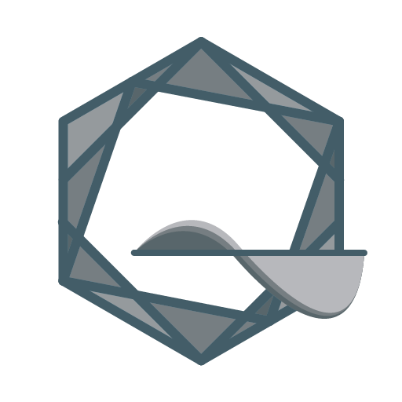

# milQuant -- Quantitative Analysis with Data from Field Desktop (Standalone electron app) <a href='https://www.miletgrabung.uni-hamburg.de/'></a>

The milQuant-Shiny Dashboard provides quick quantitative overviews of the data in a [Field Desktop](https://github.com/dainst/idai-field)-project. It connects to the database automatically (when running on the same machine) and can plot various graphs to provide quantitative visualizations for the project focused on find-resources.

The dashboard has been developed and is meant to be used with the milet-configuration and within the framework of the [Miletus Excavation Project](https://www.miletgrabung.uni-hamburg.de/). While very limited, some functionality and general overviews may also work with other project-configurations. The repository of the shiny-dashboard is located at [lsteinmann/milQuant](https://github.com/lsteinmann/milQuant).

## Usage
This distribution is meant for the team of the Miletus Excavation. If you encounter a white screen after startup, select View > Reload. On load, a login screen asks the user to input the address for synchronization and the password. The preset adress will usually work. The password is the password recorded in your Field Desktop app under "settings". After connecting, select a project in the main screen and click "Load Database".

### Places, Operations, Trenches
Then, in the sidebar to the left, select an 'Operation' (meaning a Place or a Group of Trenches) to work with, e.g. 'Insula UV/8-9' for our current project. You also need to select the trenches you want to work with in the field popping up below the Place-selector. I do not recommend always selecting everything, as it may take a long time to load, but you can always select multiple Places, Operations and Trenches.

#### Overview (DB-Project)
This plot gives a very broad overview on the project (or place) you chose to work with. It simply shows how many resources of each type (e.g. Pottery, Coin, Layer) are present in the database and informs you of the total number of resources in the upper right corner. If you have not yet selected a Place / Operation, the plot will show the contents of the whole project. Once you select a Place / Operation, the plot will show only the contents of that.

#### All Finds
In the "All Finds"-tab you can display all find resources from a layer or a group of layers across various variables. Quantification forms are not included in this count.

#### Pottery
The variable and color-selector of the pottery plot is automatically generated, and may contain many variables that you deem unusable. The period selector can be used to display only objects dated between two specific periods. I have not solved the problem of displaying multiple periods yet, though the selector works well in this case. I also still need to remove the period "groups" from this selector. 

#### Bricks and Tiles
The brick/tole plots are currently functional, but work in progress. 

#### Loomweights
For the loomweights plot, you may want to select only complete loomweights using the radio buttons. The number of bins of the histogram can be adjusted, and using the "weight range" selector you can remove outliers from the plot (if you so wish), or only look at loomweights of a certain weight group. 

### General
All plots can be given custom titles and subtitles. The plots can be saved as png or pdf using the Download-buttons. There are obviously still some bugs and problems. I appreciate it if you let me know. 


## Dependencies and other info

This app uses the [idaifieldR](https://github.com/lsteinmann/idaifieldR) package at version 0.2.2. The package is currently only available on GitHub, and is used to import data from Field Desktop / iDAI.field into R. You can install it using `devtools` or `remotes`, but running milQuant should take care of that automatically.

Apart from that there is a variety of other packages used in the dashboard, all of which can be found on CRAN and are automatically installed when trying to run the app: 
```
require("shiny", "shinydashboard", "shinycssloaders", "shinyjs", "ggplot2", "plotly", "dplyr", "reshape2", "forcats", "remotes", "idaifieldR", "shinyWidgets", "tidyr", "viridis", "glue")
```

This repository contains a distributable version of milQuant built with electron and based off [electron-quick-start](https://github.com/electron/electron-quick-start) and [COVAIL](https://github.com/COVAIL/electron-quick-start/blob/master/main.js) (see also: [lsteinmann/shiny-electron](https://github.com/lsteinmann/shiny-electron).) The directory R-win-port (locally) contains an R-portable distribution for windows.

