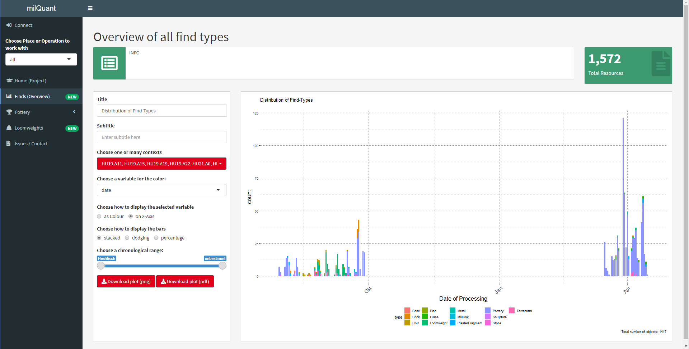
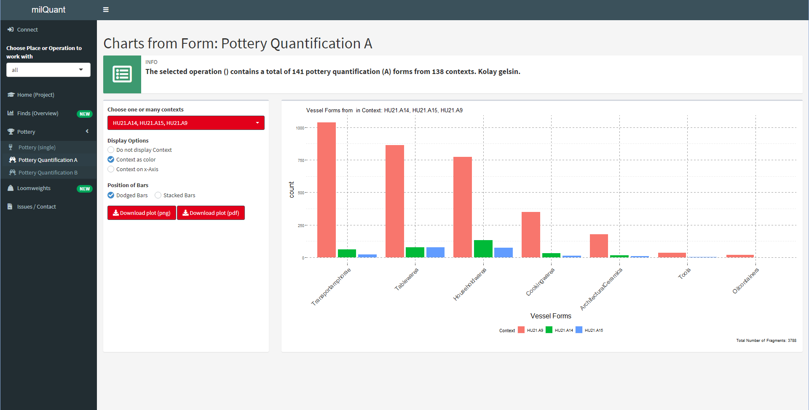
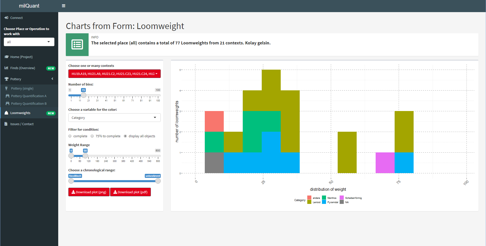

# milQuant -- Quantitative Analysis with Data from Field Desktop (Standalone electron app) <a href='https://www.miletgrabung.uni-hamburg.de/'></a>


The milQuant-Shiny Dashboard provides quick quantitative overviews of the data in a [Field Desktop](https://github.com/dainst/idai-field)-project. It connects to the database automatically (when running on the same machine) and can plot various graphs to provide quantitative visualizations for the project focused on find-resources. 

The dashboard has been developed and is meant to be used with the milet-configuration and within the framework of the [Miletus Excavation Project](https://www.miletgrabung.uni-hamburg.de/). While very limited, some functionality and general overviews may also work with other project-configurations. In any case, the App could be adapted to work for different configurations! Feel free to modify it according to your needs. 





## Usage

This distribution is meant for the team of the Miletus Excavation. If you encounter a white screen after startup, select View > Reload. On load, a login screen asks the user to input the address for synchronization and the password. The preset adress will usually work. The password is the password recorded in your Field Desktop app under "settings". After connecting, select a project in the main screen and click "Load Database".

### Places, Operations, Trenches
Then, in the sidebar to the left, select an 'Operation' (meaning a Place or a Group of Trenches) to work with, e.g. 'Insula UV/8-9' for our current project. You also need to select the trenches you want to work with in the field popping up below the Place-selector. I do not recommend always selecting everything, as it may take a long time to load. 

#### Home (Project)

#### Finds (Overview)

#### Pottery

#### Bricks and Tiles

#### Loomweights


## Dependencies and other info

This app uses the [idaifieldR](https://github.com/lsteinmann/idaifieldR) package at version 0.2.2. The package is currently only available on GitHub, and is used to import data from Field Desktop / iDAI.field into R. You can install it using `devtools` or `remotes`, but running milQuant should take care of that automatically.

Apart from that there is a variety of other packages used in the dashboard, all of which can be found on CRAN and are automatically installed when trying to run the app: 
```
require("shiny", "shinydashboard", "shinycssloaders", "shinyjs", "ggplot2", "dplyr", "reshape2", "forcats", "remotes", "idaifieldR", "shinyWidgets", "tidyr", "viridis", "glue")
```

This repository contains a distributable version of milQuant built with electron and based off [electron-quick-start](https://github.com/electron/electron-quick-start) and [COVAIL](https://github.com/COVAIL/electron-quick-start/blob/master/main.js).

The directory R-win-port (locally) contains an R-portable distribution for windows.

Icon from [icon-icons.com](https://icon-icons.com/icon/quant-qnt/245484).
