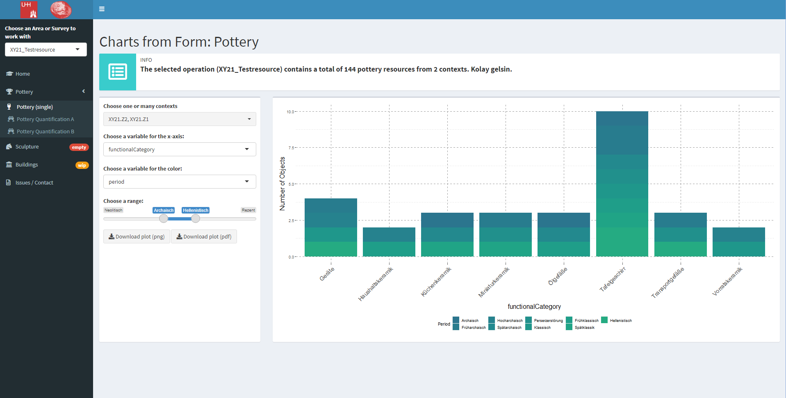

# milQuant -- Quantitative Analysis with Data from iDAI.field 2

The milQuant-Shiny Dashboard provides quick quantitative overviews of the data in an iDAI.field 2-project. It connects to the database automatically (when running on the same machine) and can plot various graphs to provide (currently very limited) quantitative visualizations for the project. While it can be adapted to other projects, it has been developed and is meant for use with the milet-configuration and within the framework of the [Miletus Excavation Project](https://www.kulturwissenschaften.uni-hamburg.de/ka/forschung/lebensformen-megapolis.html).  

## Dependencies

This app uses the [idaifieldR](https://github.com/lsteinmann/idaifieldR) package currently only available on GitHub to import data from iDAI.field 2 into R. Apart from that there is a variety of other packages used in this app, all of which can be found on CRAN.

## Adaptation

Feel free to download and adapt this to you own needs. Data import base functions are in "source/get_data.R" and if you wish to try this, the first things you need to change can be found there (i.e. projectname, server-ip, etc.). 
