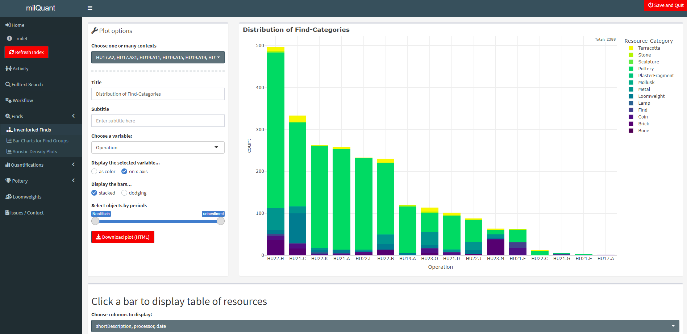
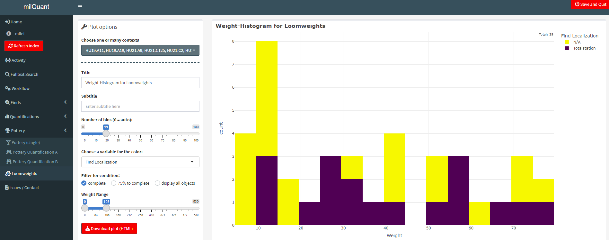

# milQuant -- Quantitative Analysis with Data from Field Desktop (Standalone electron app) 

The milQuant-Shiny Dashboard provides quick quantitative overviews of the data in a [Field Desktop](https://github.com/dainst/idai-field)-project. It can connect to any database Client in the same Local Area Network and can plot various graphs to provide quantitative visualizations for the project focused on find-resources.

The dashboard has been developed and is meant to be used with the milet-configuration and within the framework of the [Miletus Excavation Project](https://www.miletgrabung.uni-hamburg.de/). While very limited, some functionality and general overviews may also work with other project-configurations. The repository of the shiny-dashboard is located at [lsteinmann/milQuant](https://github.com/lsteinmann/milQuant).

## Usage
This distribution is meant for the team of the Miletus Excavation. On load, a login screen asks the user to input the address for synchronization and the password. The preset adress will usually work (except for the password). The password is the password recorded in your Field Desktop app under "settings". You can safe default settings for the app under "*Settings*" > "*Change connection settings*". After connecting, select a project in the main screen and click "Load Database". With the Miletus database, and depending on your computer, loading it may take between 5 seconds and half a minute. 

## Home tab
In the **Home**-tab, you are expected to select *Places* and *Operations* you want to work with. Selecting this beforehand greatly speeds up querying the database for all information needed for the plots, and reduces the amount of contexts displayed in the layer selectors. You can always switch them again here without having to reload the project database itself. 

The *Project overview* provides a general view of all resources included in the complete database project, to give you an orientation of what you could work with. *News* displays the latest changes made to the app. 

## Sidebar
The sidebar to the left is the main navigation through the App. Directly below the link to the **Home**-tab, you can see the project you have selected. When hovering your mouse over the project name, you will be informed of the selected *Place*s and *Operation*s. When pressing the **Refresh Index**-button, milQuant will import the index of the selected project database again. This way you can get new resources that have been entered while milQuant was running without restarting the app. This takes as long as loading the database to begin with. 

### Activity
The **Activity**-tab gives you a general idea of changes happening in the project database. It displays all modifications or resource creations by date. Per default it will show you all activity within the last week. You can modify the time frame, select for specific users, and decide whether you want to see the counts of newly created resources, resource modifications or both. 

### Fulltext Search
The **Fulltext Search**-tab lets you select specific kinds of resource categories you want to search through. This is especially helpful for searching single words in the larger text-input fields in *Field Desktop*, as *Field Desktop* itself will not let you do that. In this tab, you can search through e.g. **Impression** forms or **Inscription**s to find specific keywords. In the case of Inscriptions, the original content of the Inscription is also transcribed to latin characters without diacritics alongside the original, which should make it easier to find results. 

### Workflow
The workflow tab lists all resources were certain checkboxes in the *Workflow*-field have been ticked or not, and is meant to give an overview of the state of find processing and help with finding specific resources to work on. As with the **Fulltext Search**, you need to select for Layers and resources beforehand to minimize loading time and memory usage. 

### Finds
The **Finds**-tabs contain three different charts for Find-resources. In the **Inventoried Finds**-tab, you will get a general overview of all Finds from the selected layers, which you can choose from the dropdown next to the plot. **Bar Charts for Find Groups** lets you select one or more specific category of finds and display a plot using the fields suitable for bar charts. As loading all resources may take a while, you are expected to select one or more category and click *Load Resources*. It mostly makes no sense to select multiple categories, as they all use different fields, but depending on what you are planing to show it may still be useful. **Aoristic Density Plots** gives you an impression of the chronology of the contexts and their finds. For more info on this method see [datplot](https://github.com/lsteinmann/datplot) or [10.1017/aap.2021.8](https://doi.org/10.1017/aap.2021.8). With the *Derive Dating from Periods*-option enabled, all finds that do not yet have a precise dating will instead get their absolute dates from the periods that have been selected for them.

### Quantifications
The **Quantifications**-tabs display all counts from Quantification-resources. For **Quantifications (General)** all *Quantification A*-forms for the selected contexts are gathered and the value entered in the field for total count is used. If this is not filled properly in all the forms you wish to display, the data will be incorrect. Be sure to check in the database before you use this for evaluation! All other tabs in this group display the respective Quantification forms with the values gathered from the more specific fields.  

### Pottery
The variable and color-selector of the pottery plot is automatically generated, and may contain many variables that you deem unusable. The period selector can be used to display only objects dated between two specific periods. I have not solved the problem of displaying multiple periods yet, though the selector works well in this case. I also still need to remove the period "groups" from this selector. You can choose between the the single find pottery, and the two forms of quantification. With **Pottery Quantification B** it is now possible to split the counts for forms dated to multiple periods. All counts will be devided by the number of periods entered in the form. Be aware of this when using this option - since we had not originally planned on using multiple periods for this form, the results may not always be as intended or expected. 

### Loomweights
The **Loomweights**-tab contains a curated histogram plot. Here, you may want to select only complete loomweights using the radio buttons. The number of bins of the histogram can be adjusted, and using the "weight range" selector you can remove outliers from the plot (if you so wish), or only look at loomweights of a certain weight group. 

## General
All plots can be given custom titles and subtitles. As all plots are generated with plotly, you can get some information by hovering your cursor over the bars, or use the plotly options in the upper right corner to modify the plot. You can also play with the legend. The plots can be saved as an HTML using the Download-button. If you want to export the plot as an image, you can click on the camera icon in the upper right corner of the plot when hovering the cursor over it. In many plots, you can click on a bar to display a table of all objects that would be contained in that (section of the) bar, and even select which columns to display in the table. 

## Dependencies and other info
This app uses the [idaifieldR](https://github.com/lsteinmann/idaifieldR) package (not on CRAN) to import data from Field Desktop. For more info about the package, see [this article](https://doi.org/10.34780/068b-q6c7). Apart from that there is a variety of other packages used in the dashboard, all of which can be found on CRAN and are automatically installed alongside the milQuant-app.

This repository contains a distributable version of milQuant built with electron and based off [electron-quick-start](https://github.com/electron/electron-quick-start) and [COVAIL](https://github.com/COVAIL/electron-quick-start/blob/master/main.js) (see also: [lsteinmann/shiny-electron](https://github.com/lsteinmann/shiny-electron).) The directory R-win-port (locally) contains an R-portable distribution for windows, which I do not include in the online repository, but is packed in the downloadable *exe* attached to each release. 
